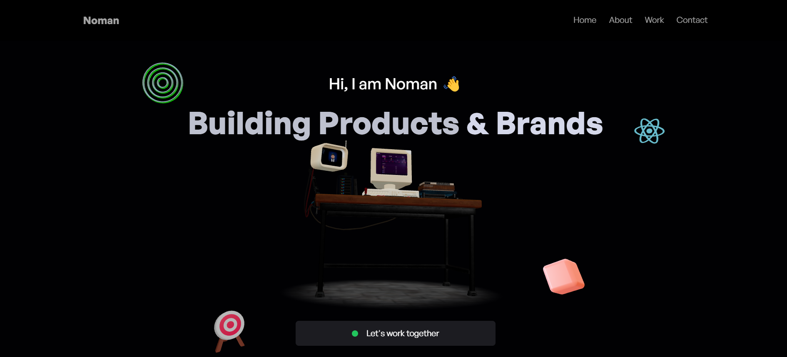

# Noman's Portfolio Website

A modern, interactive portfolio showcasing my projects, skills, and experience as a developer specializing in AI solutions and web development.



## Features

- **Interactive 3D Elements** - Engaging three.js animations that respond to user interaction
- **Project Showcase** - Detailed display of my development projects with descriptions and technologies used
- **Client Testimonials** - Feedback from past clients highlighting my expertise in AI and web development
- **Responsive Design** - Seamlessly adapts to all device sizes from mobile to desktop
- **Terminal-Style Contact Form** - Unique developer-themed contact interface
- **Work Experience Timeline** - Visual representation of my career journey and skills

## Technologies Used

- **Frontend Framework**: React.js
- **Styling**: TailwindCSS
- **3D Rendering**: Three.js
- **Animations**: Framer Motion
- **Form Handling**: EmailJS
- **Build Tool**: Vite

## Getting Started

### Prerequisites

- Node.js (v14.0.0 or later)
- npm or yarn

### Installation

1. Clone the repository
   ```bash
   git clone https://github.com/yourusername/my_portfolio.git
   cd my_portfolio
   ```

2. Install dependencies
   ```bash
   npm install
   # or
   yarn
   ```

3. Create a `.env` file in the root directory with your EmailJS credentials:
   ```
   VITE_APP_EMAILJS_SERVICE_ID=your_service_id
   VITE_APP_EMAILJS_TEMPLATE_ID=your_template_id
   VITE_APP_EMAILJS_PUBLIC_KEY=your_public_key
   ```

4. Start the development server
   ```bash
   npm run dev
   # or
   yarn dev
   ```

5. Open your browser and navigate to `http://localhost:5173`

## Project Structure

```
my_portfolio/
├── public/
│   ├── assets/           # Images, icons, and other static assets
│   └── textures/         # 3D textures for Three.js components
├── src/
│   ├── components/       # Reusable UI components
│   ├── constants/        # Configuration data and content
│   ├── hooks/            # Custom React hooks
│   ├── sections/         # Main page sections
│   ├── App.jsx           # Main application component
│   ├── index.css         # Global styles
│   └── main.jsx          # Entry point
└── ...config files
```

## Deployment

To build the project for production:

```bash
npm run build
# or
yarn build
```

This will generate optimized files in the `dist` directory that you can deploy to your hosting provider of choice (Vercel, Netlify, GitHub Pages, etc.).

## Customization

To customize the portfolio for your own use:

1. Update the content in `src/constants/index.js` with your own projects, experiences, and client reviews
2. Replace images in the `public/assets` directory with your own
3. Modify color schemes and styling in `src/index.css` to match your personal brand
4. Update contact information in the Contact section

## License

This project is licensed under the MIT License - see the LICENSE file for details.

## Acknowledgments

- 3D models and animations inspired by various Three.js examples
- Icons from [source of icons]
- Special thanks to all my clients and mentors who have supported my journey

---

Created with ❤️ by Muhammad Noman Riaz
